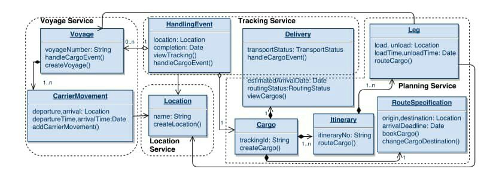

# Cloud Computing Project

An Introduction to Cloud Computing, Microservice Architecture, and Containerization concepts and applications.

## Architect your application

You are required to propose a software solution based on [Microservice architecture](https://smartbear.com/solutions/microservices/), document it all, and submit it for us.

Choose your **base project**, an old monolith project you are familiar with, big enough to be broken apart into smaller services, forming a micro service, note that you will create a minimal functionality application for each service([Minimum Viable Product](https://www.interaction-design.org/literature/article/minimum-viable-product-mvp-and-design-balancing-risk-to-gain-reward)), for example, for an identity management service, login in, and registration is enough, in other word if your base project is much bigger, you can just create essential services and not use the rest of the monolith application.  
You can use existing codes you have written, the goal here is to **create at least 3 micro services**, in a minimal and simple way.  
You can propose a **Monolith** that you or your teammates has worked on, or you can find any open source existing Monolith project written in any language.  
Using the following projects is a **plus**:

- [https://github.com/bvn13/SpringBlog](https://github.com/bvn13/SpringBlog).
- [https://github.com/citerus/dddsample-core](https://github.com/citerus/dddsample-core).
- [https://github.com/mybatis/jpetstore-6](https://github.com/mybatis/jpetstore-6).
- [https://github.com/microservices-patterns/ftgo-monolith](https://github.com/microservices-patterns/ftgo-monolith).

You must link your Monolith and explain its functionalities and its file structure, and how it works.

The process of turning a [Monolith to a Micro service](https://insights.sei.cmu.edu/blog/8-steps-for-migrating-existing-applications-to-microservices/) is very important and very complex, we are going to scratch the surface. The candidate files and classes that are going to be a micro service must be documented, for example you must specify which portion of the Monolith files and classes are going to be Service A, and which are going to be Service B or if you are going to develop new code for a service you must specify it.

In this phase you are going to select your candidate services from Monolith project.


It does not matter what framework or programming language you are using, in fact in this section you are not required to implement anything, you must write down explicitly 1.your **reasons** for [choosing these services](https://tanzu.vmware.com/content/blog/should-that-be-a-microservice-keep-these-six-factors-in-mind), 2.each service portion of code from Monolith, 3.your plan for extraction of microservice from monolith project(order of developing these services), your team members and [team work plans](https://stackoverflow.com/a/3000392/12131234)(choose one with more experienced as team leader).

- Your Architecture must contain a user management service for issuing JWT tokens.

JWT is used as an authorization token, it contains user information and is singed with server private key.


Interesting feature of a JWT token is that when a remote service has the private key of the issuer it can authenticate user identity by checking the signature of the JWT token. This means that your services must authenticate user identity by checking the signature of the JWT token.

You can use any open source library to generate or decode a JWT token, for example [JWT](https://github.com/golang-jwt/jwt).  
You can also use libraries for popular frameworks such as [Django simple JWT](https://github.com/jazzband/djangorestframework-simplejwt).

- Minimal functionality that works flawlessly is required, we want small and simple services, not a big and full featured application, for example sign up and obtain token endpoints for user management service.

- using diagrams is a good way to document your architecture, using [Google drawings](https://docs.google.com/drawings) or [Ascii flow](https://asciiflow.com/) is recommended.

- Documenting your proposal in a [markdown file](https://www.markdownguide.org/basic-syntax/) is recommended, create a github repository and put your docs there, create an issue and link your git repository here.

- Using [RESTFUL API](https://restfulapi.net/) is recommended for **user endpoints**, You can use any [library](https://github.com/encode/django-rest-framework) or [framework](https://github.com/tiangolo/fastapi) to simplify the process.

> Note: A client side application is not counted as a service in this exercise. And you are not required to implement a client side application. Using Swagger is a minimum.

- For implementation in next phase, No client side application is forced, but suitable tools are required for testing, swagger or postman is recommended(you must put the last version of api documentation schema in the root of project if it is not auto generated).

- You must design with at least **three microservice in action**, you **must use an existing monolith** project as your base, reduce its features if its too big, or increase its features if its too small. You can later use the old code base too.

Consider the `Pooya` panel, for students and teachers and staff users, this is a gigantic project, and we have to break it down into smaller services. Our first service is `User management` for issuing JWT tokens and registering. The second service is `Course management` for creating courses and adding students to courses. The third service is `Student attendance management` for marking students attendance in each course. And the last service is `food management` for adding meals and buying food.


<sub>_[access diagram 1](https://docs.google.com/drawings/d/1PF89Usn8z90N30fwD6SbfoFoWelLuc0EhWnR4t6Go8w/edit?usp=sharing)_</sub>

As you can see this diagram is very top level and explains different services and user interactions.

Each service **[has its own database](https://microservices.io/patterns/data/database-per-service.html)**, you must design your databases and add to your documentation(of course it may change in future but it is essential for you to know your data in each service). choose your services carefully as it may cause coupling between different services. consider `Course management` and `Student attendance management`, they must be synced on these two questions:

- What are our courses?
- Who is taking these courses?

Think about it, if a teacher sends this request: `Attend True student id: 1, course id: 1`, how do the `Student attendance management` service know that the student is taking the course? or the course is real? the simplest way is to ask the `Course management` service every time with a message: `Hey course management, does this student: 1, taking this course: 1?`, or another way is to push changes in couser-student table to `Student attendance management` and replicate the database...


<sub>_[access diagram 2](https://docs.google.com/drawings/d/1D9_1H81qM_k5kU7j8H3UYpFJLCSdiShI6Hi8oNGeCjs/edit?usp=sharing)_</sub>

Another example: As you can see this is entity diagram of a tracking system and how it is broken down into different services.  


As you can see there are inevitable data dependencies between our services, especially on `user` table, with favor of JWT token we can just authorize users by the payload of JWT token, but in case of not using a JWT token, we had to contact the `user management` service for each user request and ask if the user is authorized or not, for example, if a student requests `Hi I am student with session id: X, can I take course: Y?` in `course management` service we have to ask `user management` service `Hi user management, is session id: X a valid user and is he a student?`.

In a real Microservice with tens of services, you can imagine how complex it would be to communicate and synchronize data.


Highly recommend watching [this video on youtube](https://www.youtube.com/watch?v=CZ3wIuvmHeM) about Netflix Microservice Architecture.

And in the last section, you must specify any internal call between your services, and specify the dependency that caused this action, also we are going to use [GRPC](https://grpc.io/) to communicate.  
For example which piece of code in the Monolith made us to implement an internal GRPC call??  
#### Dependency example:####

```
    attendance-service --> course-service:
        where: monolith/courses/models.py, class: Course
        happened: monolith/attendance/views.py, class: AttendanceView
        code: Courses.objects.get(id=course_id)
        reason: imported and used
        solution: GRPC
    course-service --> user-management-service:
        where: monolith/users/models.py, class: User
        happened: monolith/courses/views.py, class: CourseView
        code: Users.objects.get(id=student_id)
        reason: must obtain user from database
        solution: trust user_id from jwt token
```


<sub>_[access diagram 3](https://docs.google.com/drawings/d/1HYA063pqDlEzRXHppd3D1u6ELBFjnc83aebRoWoSke8/edit?usp=sharing)_</sub>

- Your design must have at least one internal call.

- Using GRPC is recommended, also you can reason using other options(except REST).

> Assignment Estimated time: 7 - 15 hours.

# Summary

You are asked to migrate an existing monolith project to a microservice architecture, following these steps:

1. Find a monolithic project with adequate complexity.
2. Design a microservice architecture consisting of at least 3 microservices, each of which with a specific non-trivial data storage component such as a database with at least a table (stateful microservices).
3. Prepare a document for written details (markdown file).
4. Create a diagram for service entities similar to diagram 2 or the tracking system diagram.
5. Create a diagram that indicates the services along with their internal and external api connections. (similar to diagram 3)
6. Read this document and satisfy other requirements.

### Documents expected details

- Describe at a very high level the system's architecture, identifying the components/modules that will interact.
- What is interesting about this project from a technical point of view?

### Project Constraints

- Your design must have at least one internal GRPC call.
- Work in groups of two or three to brainstorm several possible projects and architectures.
- Be prepared to present your project proposals.

# Future steps

After thoughtfully designing your architecture, your are going to follow these steps:
* Phase 2: Developing your services and Dockerizing them.
* Phase 3: Deployment with Kubernetes.
